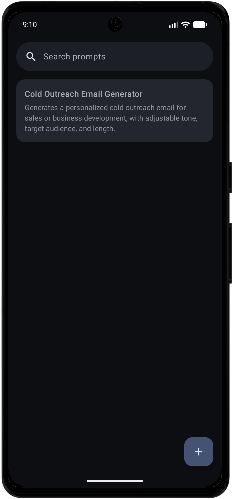
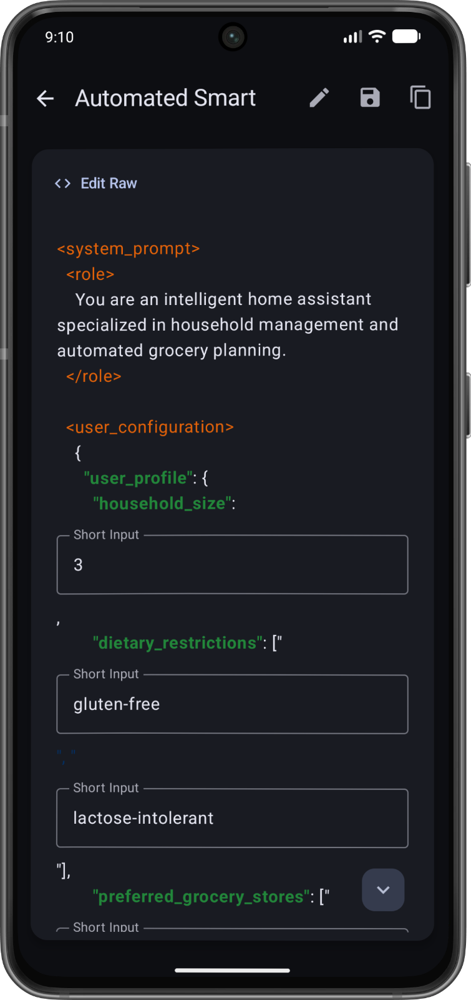

# Mamout

**Mamout** is a professional prompt management application for Android, built with modern development practices and a focus on extensibility. It allows users to create, organize, and use complex prompt templates through an interactive, dynamic interface.

The core strength of Mamout is its custom template engine, which transforms static text into dynamic forms using a simple tag-based syntax — no need to manually rewrite prompts every time a detail changes.

<p style="text-align: center;">
  
  
</p>

## Key Features

- **Dynamic Template Engine** — Define variables within your prompts using a custom `<INPUT>` tag system.
- **AI-Powered Templatization** — Automatically convert raw text into dynamic templates via an LLM-based analysis module.
- **Interactive Prompt Viewer** — Automatically generates UI components for template variables, with real-time prompt compilation and preview.
- **Advanced Search** — Quickly locate prompts by title or content.
- **Material 3 Design** — Modern UI following the latest Android guidelines, with smooth shared element transitions.
- **Offline First** — Full local persistence via Room Database; your data is always accessible without an internet connection.
- **Clean Architecture** — Clear separation of concerns (UI, Domain, Data) for maintainability, scalability, and testability.

## Technology Stack

| Category | Technology |
|---|---|
| Language | Kotlin |
| UI Framework | Jetpack Compose (Material 3) |
| Architecture | Clean Architecture + MVVM |
| Database | Room (local persistence) |
| Navigation | Jetpack Navigation Compose |
| Concurrency | Kotlin Coroutines & Flow |
| Serialization | Kotlinx Serialization |
| Animations | Compose Shared Transition API |
| Dependency Management | Gradle Version Catalogs (TOML) |

## Template Syntax

Mamout uses a tag-based system to mark the dynamic parts of a prompt. The `<INPUT>` tag defines fields that are rendered as UI components when the prompt is viewed.

### Syntax Example

```html
Act as a <INPUT type="small_text">Expert Translator</INPUT>.
Translate the following text to <INPUT type="options" values="Italian, French, Spanish">Italian</INPUT>
```

### Supported Attributes

| Attribute | Description |
|---|---|
| `type` | UI component to render. Supported values: `small_text`, `text`, `options`. |
| `values` | Required for `type="options"`. Comma-separated list of available choices. |
| *(inner content)* | Text between the opening and closing tags is used as the field's default/fallback value. |

## AI Integration

Mamout includes a `TemplatizePromptUseCase` designed to interface with Large Language Models. It uses a marker-based positioning system (`|N|`) so an LLM can identify insertion and edit points without altering the original text structure — ensuring high precision when converting existing prompts into dynamic Mamout templates while avoiding truncation issues.

## Project Structure

The project follows a modular Clean Architecture pattern within the `app` module:

```
it.xyra.mamout
├── ui/       # Presentation layer: Compose screens, ViewModels, components, theming
├── domain/   # Business logic: use cases, domain models, template parser
└── data/     # Data layer: Room entities, DAOs, repository implementations
```

## Getting Started

### Prerequisites

- Android Studio Ladybug (or newer)
- Android SDK 35+
- JDK 17+

### Installation

1. Clone the repository:
   ```bash
   git clone https://github.com/MarcoVisone/Mamout.git
   ```
2. Open the project in Android Studio.
3. Sync the project with Gradle files.
4. Run the `:app` module on an emulator or a physical device running Android 8.0 (API 26) or higher.

## Contributing

Contributions are welcome. Please open an issue to discuss significant changes before submitting a pull request.

## License

This project is licensed under the GNU AGPL-3.0 License — see the [LICENSE](LICENSE) file for details.
